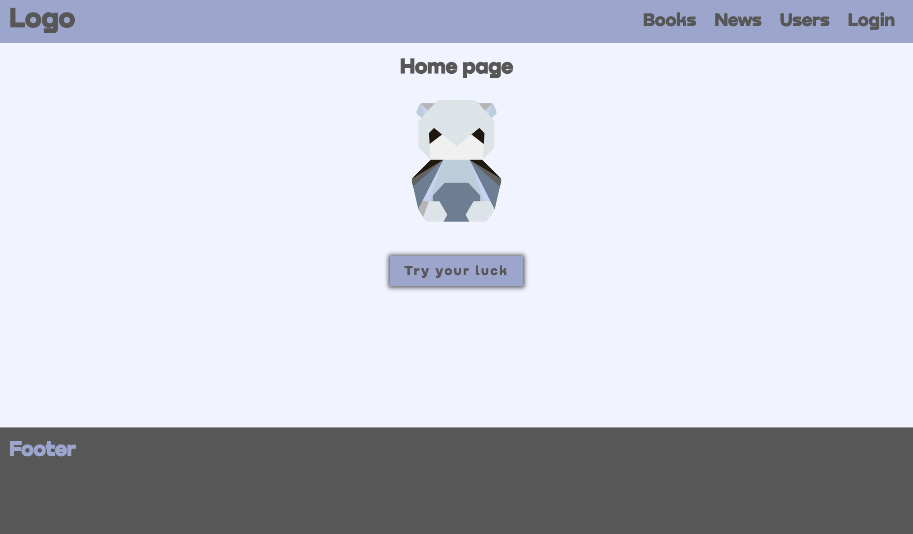

## Panda

 

 

### Сборка приложения для DEV-режима:

1. Создайте файл .env на примере файла .env.example (данные и ключи можно использовать такие же).

2. Для запуска

   - в Docker:
     `make dc-dev`
     или
     `docker-compose --file docker-compose-dev.yml up --build --remove-orphans`
   - локально:
     1. Backend
        `make back_run_dev`
        или
        `cd backend && npm install && npm run start:dev`
     2. Frontend
        `make front_run_dev`
        или
        `cd frontend && npm install && npm run webpack-config-dev`

3. Дождитесь, когда установятся все зависимости и запустяться все сервисы.

4. Открыть готовое приложение на странице ( http://localhost:3000 ).

 
 

### Сборка приложения для PROD-режима:

1. Создайте файл .env на примере файла .env.example (данные и ключи можно использовать такие же).

2. Для запуска

   - в Docker:
     `make dc-prod`
     или
     `docker-compose --file docker-compose-prod.yml up --build --remove-orphans`
   - локально:
     1. Backend
        `make back_run_prod`
        или
        `cd backend && npm install && npm run start:prod`
     2. Frontend
        `make front_run_prod`
        или
        `cd frontend && npm install && npm run start-prod`

3. Дождитесь, когда установятся все зависимости и запустяться все сервисы.

4. Открыть готовое приложение на странице ( http://localhost:3000 ).

 
